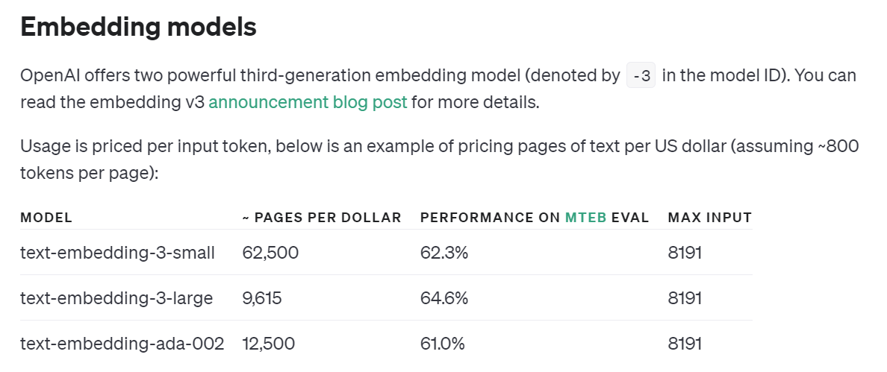

# lawRAG

## 项目架构

1. 分块： 
 - 固定长度切片：利用langchain进行固定长度切片。
 - 大模型内容感知切片：将较长的文本docx, pdf, txt上传，提取关键知识返回树状JSON。
 - 专门分块：Markdown和LaTeX是可能遇到的结构化和格式化内容的两个示例。在这些情况下，可以使用专门的分块方法在分块过程中保留内容的原始结构。 Markdown：Markdown是一种轻量级标记语言，通常用于格式化文本。通过识别Markdown语法（例如标题、列表和代码块），根据内容的结构和层次结构智能地划分内容，从而产生语义上更连贯的块。
2. 向量化embeddings：
 - base embedding
 - OpenAI embedding:

 - zhipu embedding
3. 向量数据库索引：
4. 问答：利用openai API和qwen-max api进行回答
5. 前端展示

## 项目意义

1. 问答系统（QA Systems）：RAG可以用于构建强大的问答系统，能够回答用户提出的各种问题。它能够通过检索大规模文档集合来提供准确的答案，无需针对每个问题进行特定训练。
2. 文档生成和自动摘要（Document Generation and Automatic Summarization）：RAG可用于自动生成文章段落、文档或自动摘要，基于检索的知识来填充文本，使得生成的内容更具信息价值。
3. 智能助手和虚拟代理（Intelligent Assistants and Virtual Agents）：RAG可以用于构建智能助手或虚拟代理，结合聊天记录回答用户的问题、提供信息和执行任务，无需进行特定任务微调。
4. 信息检索（Information Retrieval）：RAG可以改进信息检索系统，使其更准确深刻。用户可以提出更具体的查询，不再局限于关键词匹配。
5. 知识图谱填充（Knowledge Graph Population）：RAG可以用于填充知识图谱中的实体关系，通过检索文档来识别和添加新的知识点。

## reference
https://github.com/KMnO4-zx/TinyRAG
https://arxiv.org/abs/2005.11401

# lawRAG
# lawRAG
